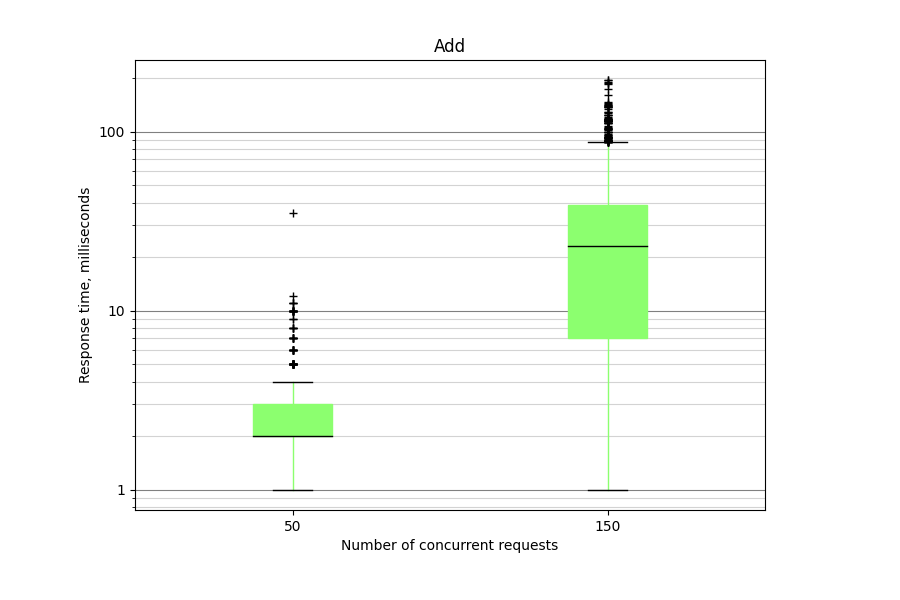
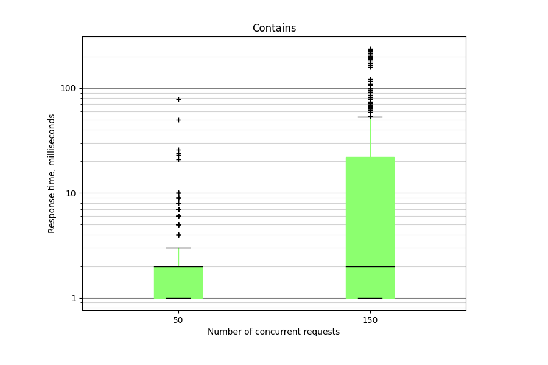
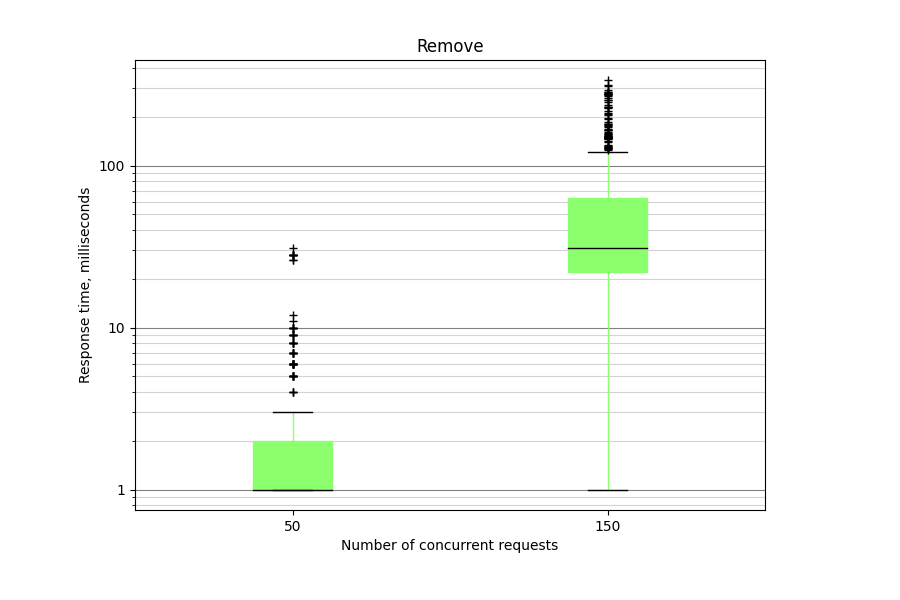
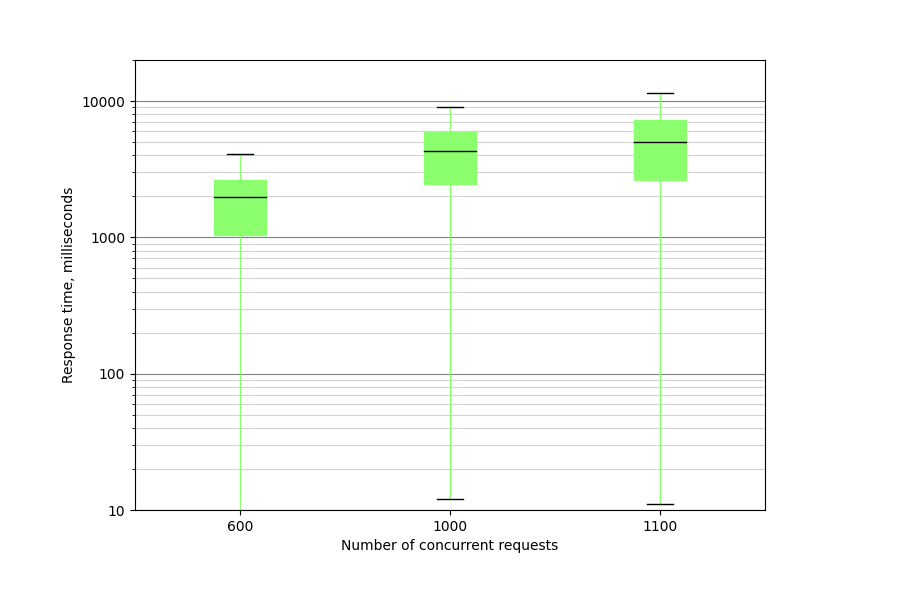

# Docker
```
docker build -t examsystemapi:latest .
docker run -p 8080:80 examsystemapi:latest

```

# Результаты нагрузочного тестирования
## Striped сuckoo hash set
### Распределение времени выполнения запросов каждого вида


### Число клиентов, приводящее к отказу от обслуживания по таймауту в 10 секунд
Число клиентов -- 1300, примерное количество записей в словаре -- 215


## Coarse grained hash set
### Распределение времени выполнения запросов каждого вида



### Число клиентов, приводящее к отказу от обслуживания по таймауту в 10 секунд
Число клиентов -- 1100, примерное количество записей в словаре -- 171

