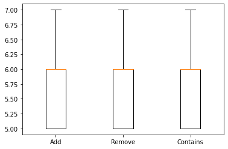
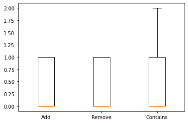
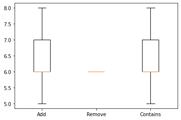
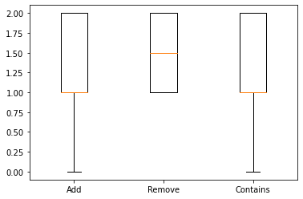
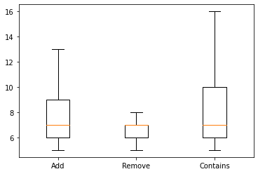
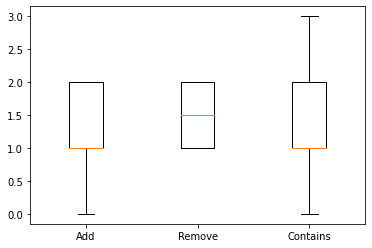

## Usage

```Bash
docker build -t <tag> <path to folder with Dockerfile>
```

```Bash
docker run -p 80:80 <tag>
```

## Max users

- Optimistic set - 660 users with 16k entries
- Lazy set - 1000 users with 7k entries

## No load

### Optimistic set



### Lazy set



## 50 RPS

### Optimistic set



### Lazy set



## 100 RPS

### Optimistic set



### Lazy set

