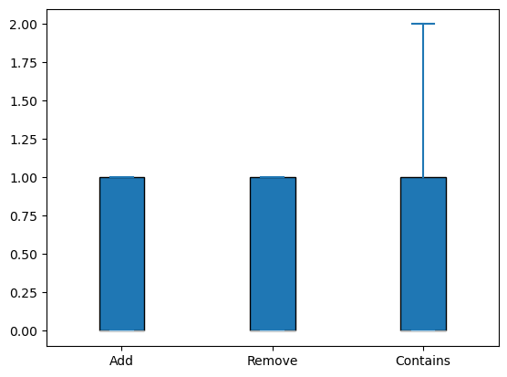
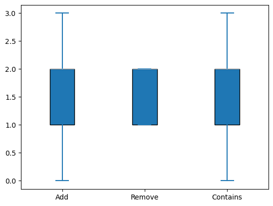
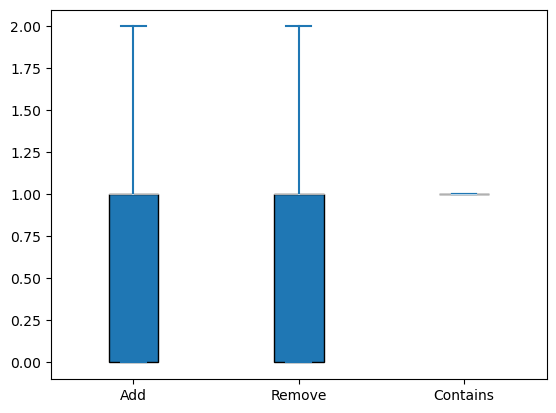
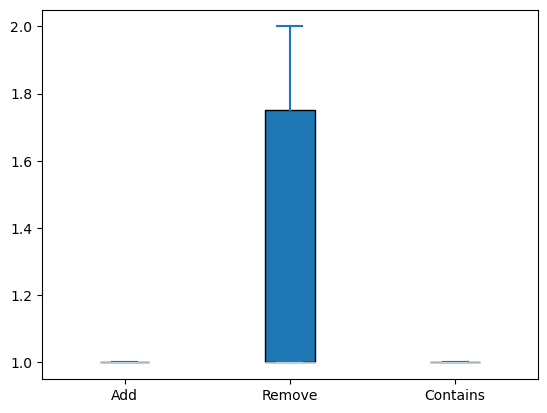
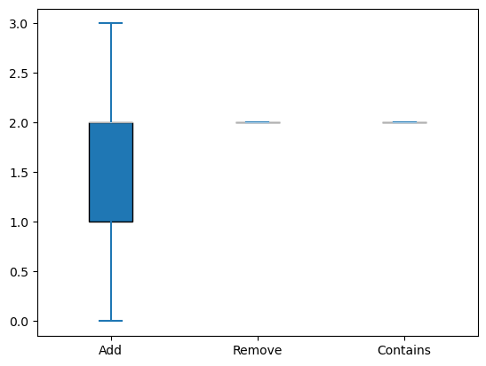
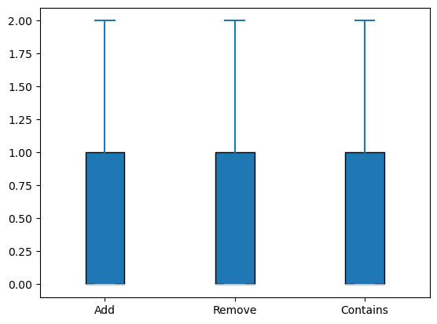

# Exam system

## Docker build quickstart

Run the following command to build an image:

```Bash
docker build --tag exam-system .
```

To run the container:

```Bash
docker run -p port:80 exam-system type
```

Where `port` is the port you want to use and `type` is the data structure that will be used by the system (either `fine-grained` or `optimistic`).

## Load testing

- Fine-grained set -- max 1000 users, ~17000 records
- Optimistic set -- max 500 users, ~25000 records

## Fine-grained set

### No load



### 10 RPS



### 100 RPS



## Optimistic set

### No load



### 10 RPS



### 100 RPS


