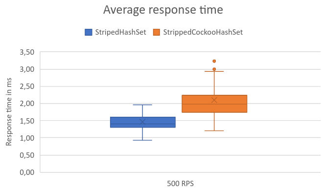

# Exam Web API #

Реализовано и обёрнуто в ASP.NET CORE WEB API ядро для деканата матмеха. Веб интерфейс не представлен. Если студент получил зачёт, то он находится в системе. Если же у стеднта нет зачёта, то он не будет находится в системе. Возможно выполнять следующие API запросы:

1. Add (http://localhost/Exam/add?studentId=0&courseId=0) - Поставить зачёт
2. Remove (http://localhost/Exam/remove?studentId=0&courseId=0) - Убрать зачёт
3. Contains (http://localhost/Exam/contains?studentId=0&courseId=0) - Проверить наличие зачёта
4. Count (http://localhost/Exam/count) - Общее количество зачётов в системе

## Запуск Docker образа ##

1. Создание контейнера

```console
docker build -t exam-system:latest .
```

2. Запуск контейнера

```console
docker run --rm -p 80:80 exam-system
```
## Нагрузочное тестирование ##

Нагрузочное тестирование проводилось с использованием JMeter. Со следующими параметрами:

* Number of thread (Users): 50
* Ranp-up period (seconds): 3

### Распределение времени запросов в отсутствии другой загрузки: ###

CoreCuckooHashSet 1000 RPS

---
StripedHashSet 1000 RPS

---
StripedHashSet 4200 RPS

---

### Распределение времени запросов при двух заданных уровнях нагрузки: ###

Запросы проводились в следующем соотношении: 90% всех вызовов - Contains, 9% - Add, 1% - Remove.

StripedHashSet и StripedCockooHastSet 500  RPS

---

StripedHashSet и StripedCockooHastSet 1000  RPS

---

### Таймаут 120ms ###

Число клиентов приводящее к timeout 120ms.

StripedHashSet. Число клиентов 500, примерное количество записей в системе - 4489

StripedCockooHastSet. Число клиентов 240, примерное количество записей в системе - 2594.