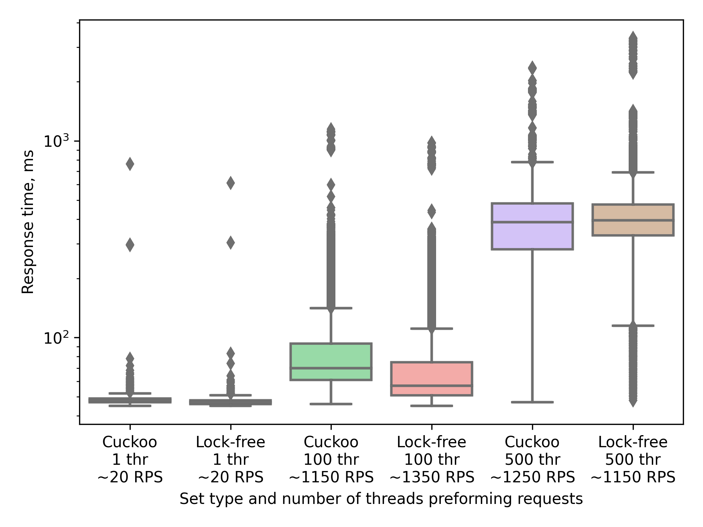

# ExamSystem #

### API ###

- **Count**: GET `<Host>/count`
- **Add**: POST `<Host>/?studentId=<sid>&courseId=<cid>`
- **Contains**: GET `<Host>/?studentId=<sid>&courseId=<cid>`
- **Remove**: DELETE `<Host>/?studentId=<sid>&courseId=<cid>`

### Build and run ###

Binds to :8080

- Local

```shell
SET=<set> ./gradlew run
```

- Docker (from Dockerfile)

```shell
docker build .
docker run -d -p 8080:8080 -e SET=<set> ktor-docker-image:latest
```

- Docker (from .tar)

```shell
./gradlew buildImage 
docker load < build/jib-image.tar
docker run -d -p 8080:8080 -e SET=<set> ktor-docker-image:latest
```

SET options:

- cuckoo
- lock-free

### Load testing ###



### Timeout 1s
Lock-free: 1312 RPS  (2559 values in set)

Cuckoo: 1296 RPS  (1621 values in set)
