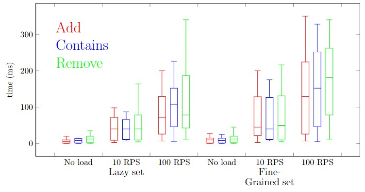

## Usage with Docker
Enter the root folder with the solution (.sln) file and create the container:
```sh
docker build -t <name> -f WebDekanat\Dockerfile .
```
and then run it:
```sh
docker run -p 80:80 <name>
```

### Max load

- Lazy set - 2000 users on about 27k entries
- Fine-grained set - 780 users on about 3k entries

### Performance results
