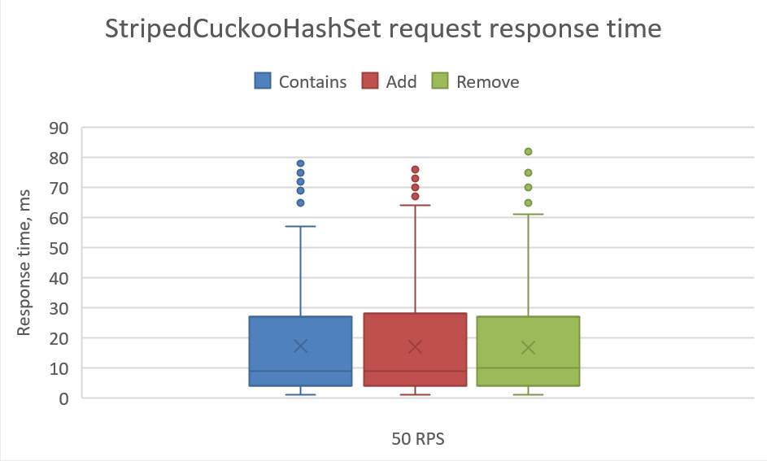
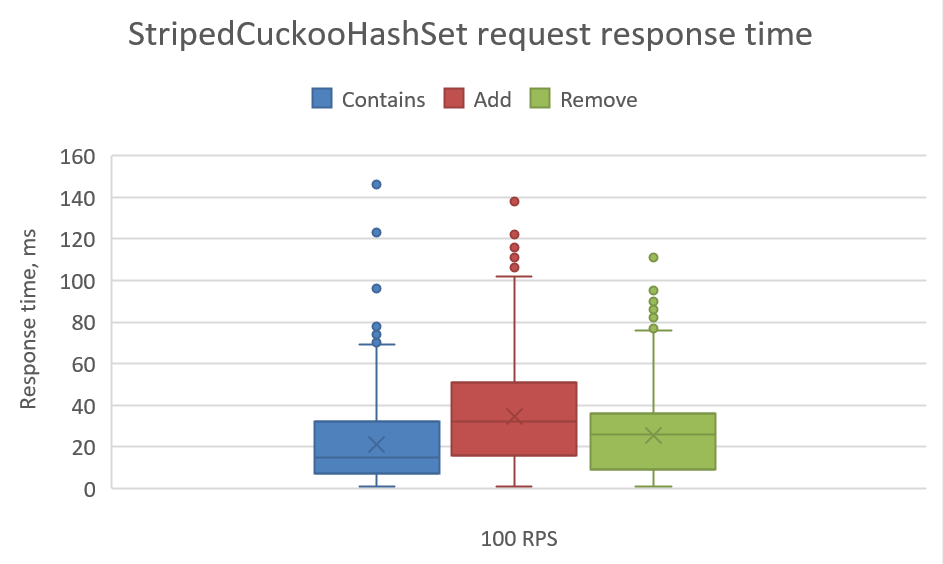
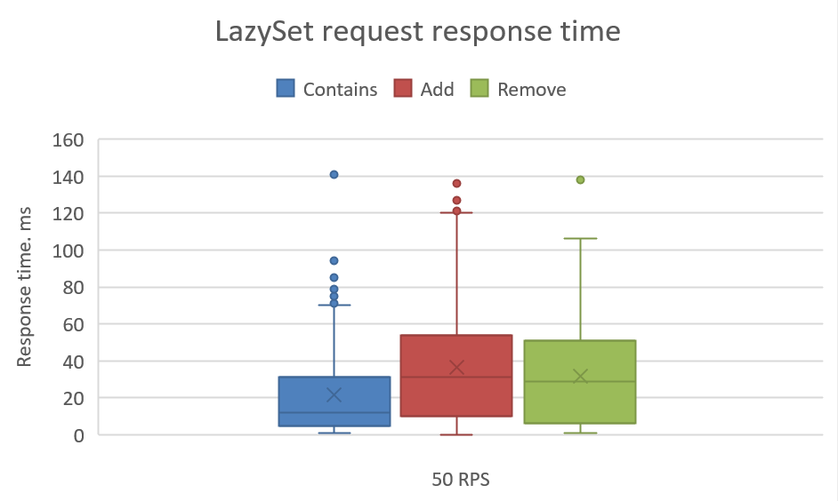
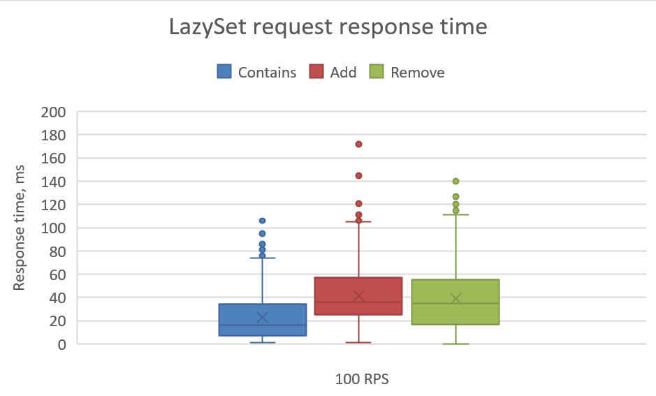
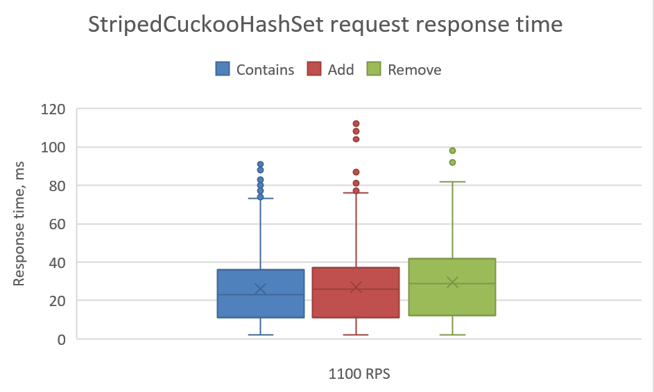
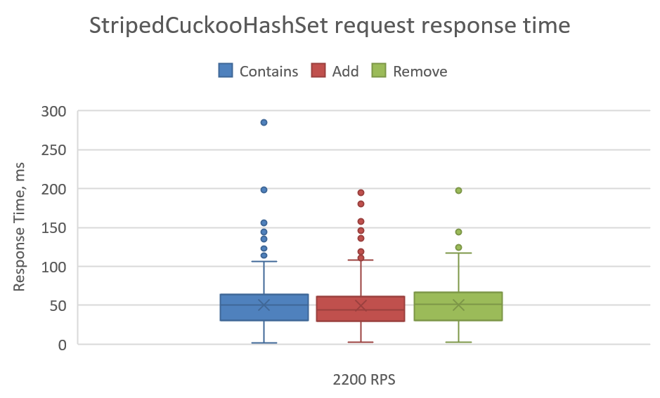
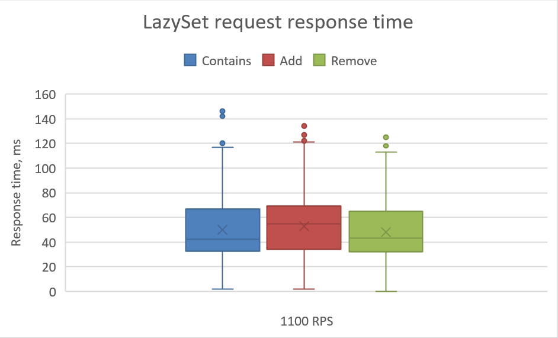
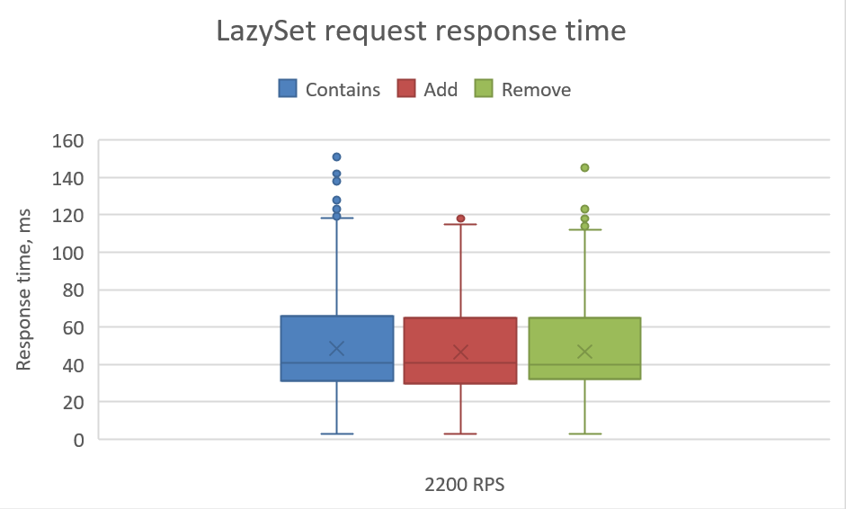

# Dekanat API #

Dekanat web API поддерживает четыре команды:

1. Add (http://localhost/Dekanat/Add?studentId={number}&courseId={number}) - Добавить зачёт студенту
2. Remove (http://localhost/Dekanat/Remove?studentId={number}&courseId={number}) - Убрать зачёт у студента
3. Contains (http://localhost/Dekanat/Contains?studentId={number}&courseId={number}) - Проверить наличие зачёта у студента
4. Count (http://localhost/Dekanat/Count) - Получить общее количество зачётов на данный момент

## Запуск Docker образа ##

1. Создание контейнера

```console
docker build -t <Название> .
```

2. Запуск контейнера

```console
docker run -p 80:80 <Название>
```
## Нагрузочное тестирование ##

Для нагрузочного тестирования был использован JMeter. 
Параметры тестирования для каждого вида запроса выглядели так:

* Target Concurrency (Users): 20
* Ramp-up time (seconds): 5
* Hold Target Rate time (seconds): 15

### Распределение времени запросов в отсутствии другой загрузки: ###

StripedCuckooHashSet 50 RPS

---
StripedCuckooHashSet 100 RPS

---
LazySet 50 RPS

---
LazySet 100 RPS

---

### Распределение времени запросов при двух заданных уровнях нагрузки: ###

Запросы проводились в следующем соотношении: 90% всех вызовов - Contains, 9% - Add, 1% - Remove.
Суммарно запросов в секунду было 1100 и 2200.

StripedCuckooHashSet 1100 RPS

---

StripedCuckooHashSet 2200 RPS

---

LazySet 1100 RPS

---

LazySet 2200 RPS

---

### Критическое число пользователей ###

Число пользователей, приводящее к Connection TimeOut 4000 ms

LazySet. Число клиентов 520, примерное количество зачётов в деканате - 418.

StripedCuckooHastSet. Число клиентов 656, примерное количество зачётов в деканате - 216.