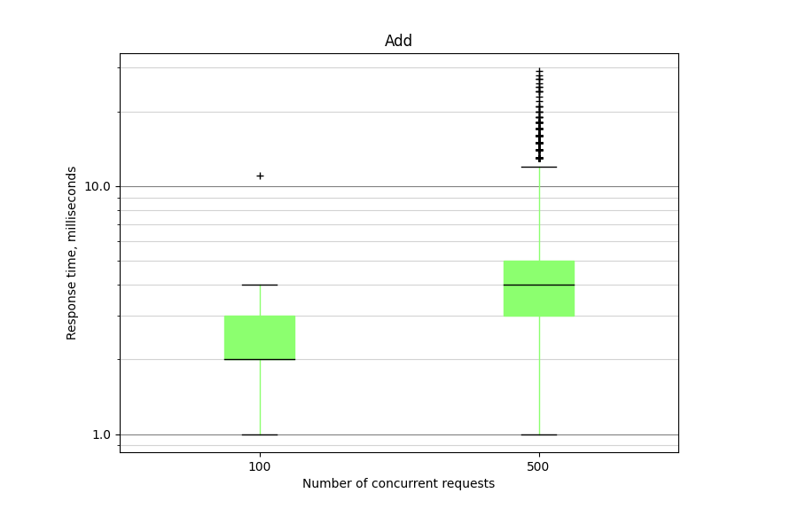
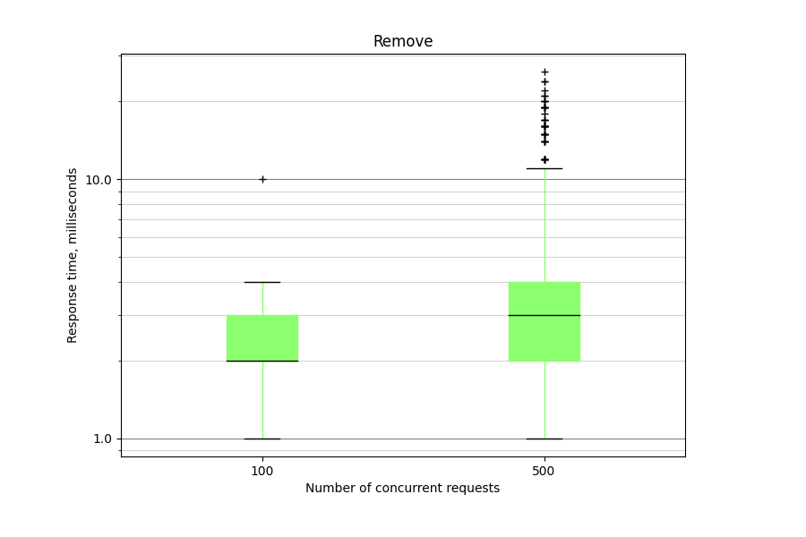
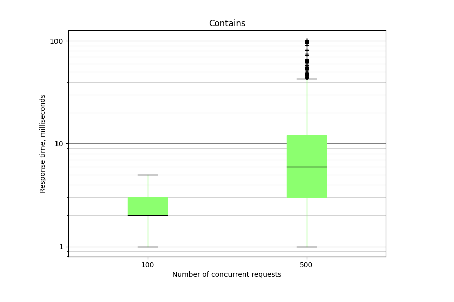
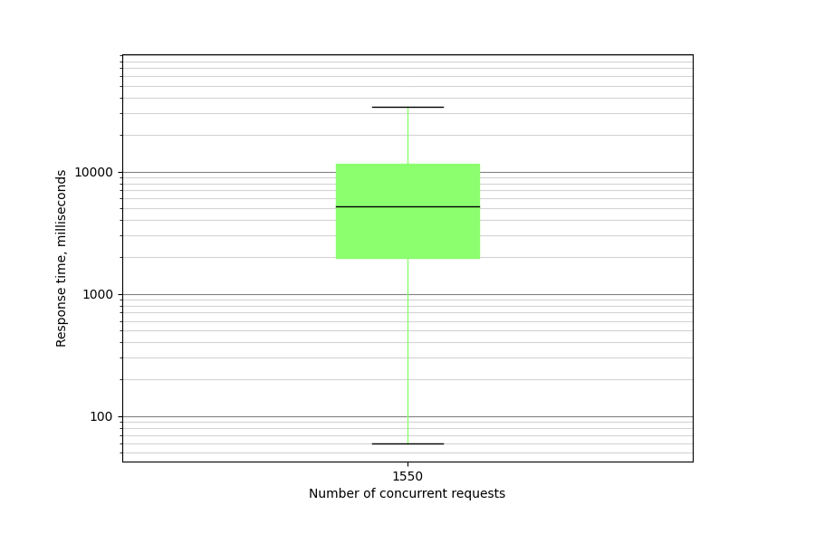
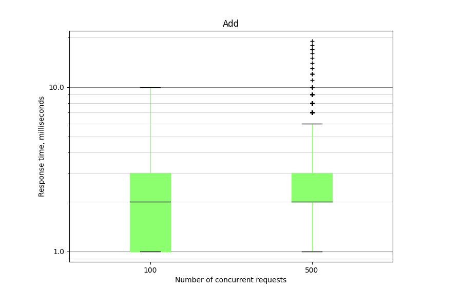
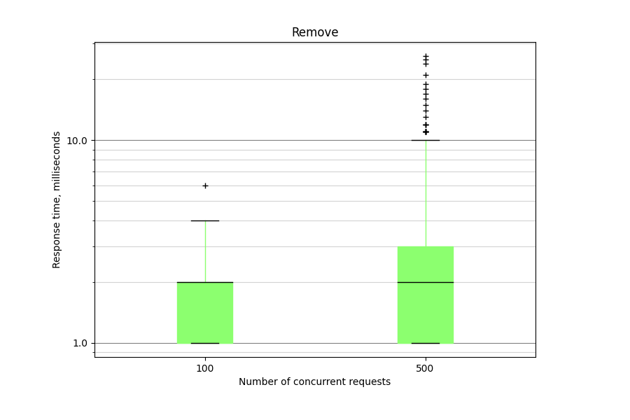
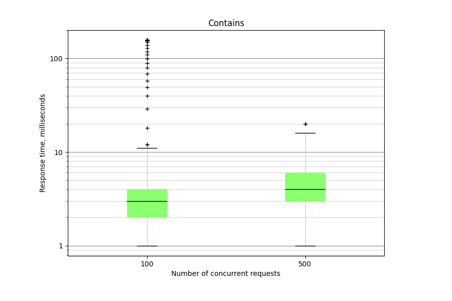
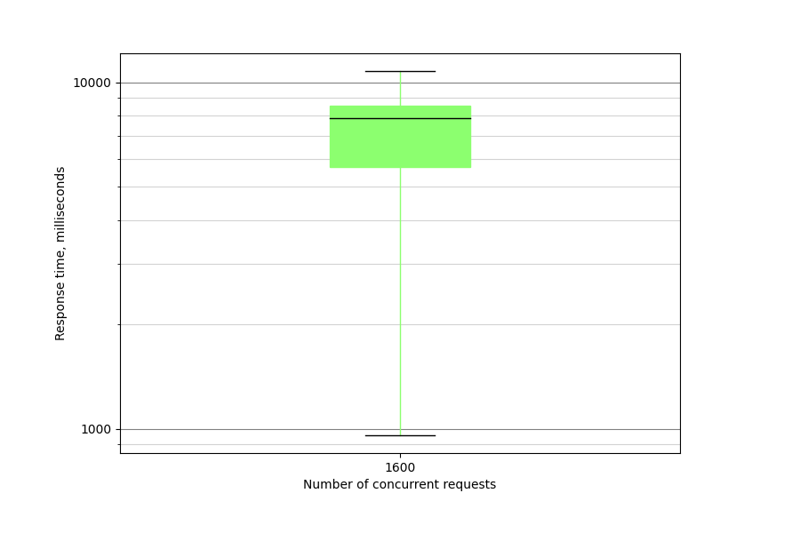

# Конфигурация запуска образа
В папке с Dockerfile
```
docker build -t deanery .
docker run -p 80:80 deanery
```
# Нагрузочное тестирование
## LazySet



### Отказ от обслуживания при 1550 rps, примерное число записей 190


## StripedCuckooHashSet



### Отказ от обслуживания при 1600 rps, примерное число записей 210
