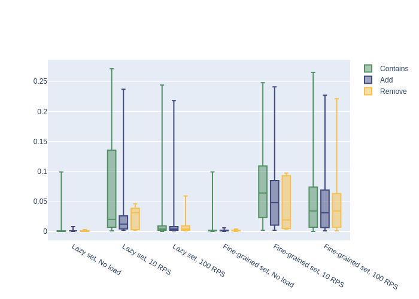

# Credit System

Web API of the credit system.

## Build and run with docker
In the solution root directory run following commands:
```sh
docker build -t credit-system .
```
```sh
docker run <port>:80 credit-system <type>
```
Where `<port>` is port on your machine that will be redirected to container port 80 and `<type>` is a type of data structure that is used to store credits. `<type>` must be `fine-grained` or `lazy`.

## Load testing
Load testing was performed using the [JMeter](https://jmeter.apache.org/).

### Max users count

- With lazy set - 4000 users with ~45k records
- With fine-grained set - 1000 users with ~5k records

### Box plots

